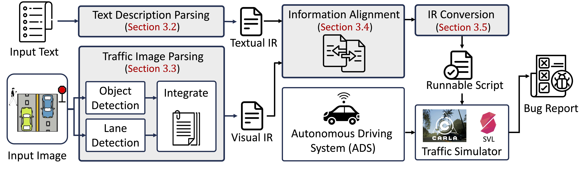

# TrafficComposer
The official repo for the FSE 2025 paper "Multi-Modal Traffic Scenario Generation for Autonomous Driving System Testing".

[Project Homepage](https://hcss.cs.purdue.edu/trafficcomposer/) | [GitHub](https://github.com/TrafficComposer/TrafficComposer/)

  

coming soon...